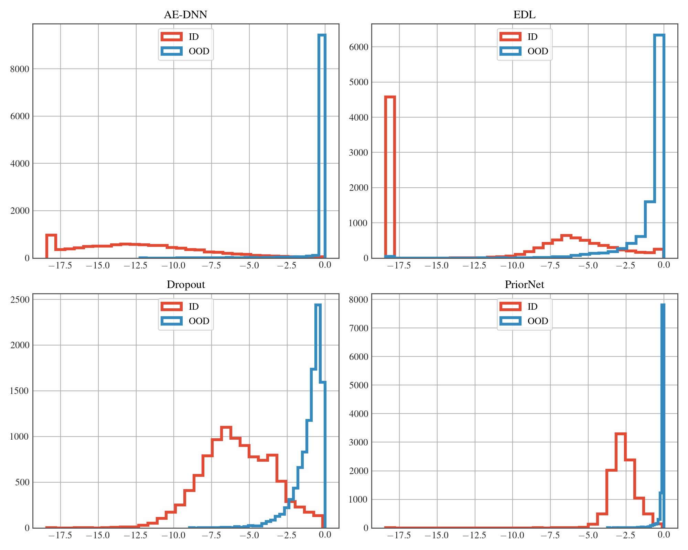
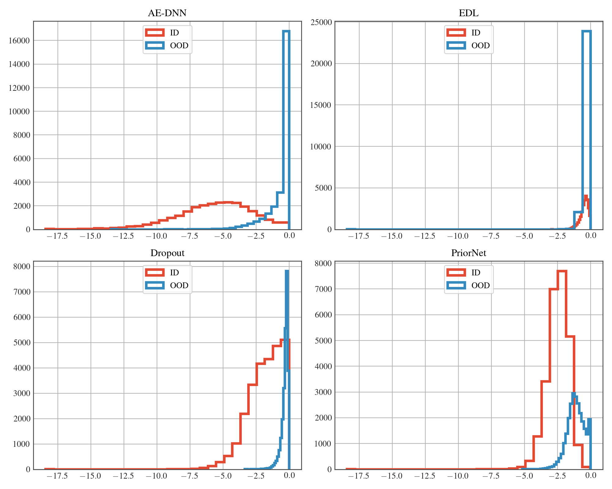

# AE-DNN
Code for reproducing some key results of our ICPR 2020 paper *"Separation of Aleatoric and Epistemic Uncertainty in Deterministic Deep Neural Networks"*


# Table of contents
1. [Introduction](#introduction)
2. [Uncertainty Histograms](#unc_hist)
    1. [Unnormalized](#unnormalized)
    1. [Logarithmic](#logarithmic)
3. [Reproduce](#paragraph2)
    1. [Requirements](#requirements)
    2. [Experiment](#experiment)


## Uncertainty Histograms<a name="unc_hist"></a>
### Unnormalized <a name="unnormalized"></a>

#### MNIST vs. NotMNIST

#### SVHN vs. CIFAR10

#### CIFAR5 vs. CIFAR5


### Logarithmic <a name="logarithmic"></a>
#### MNIST vs. NotMNIST

#### SVHN vs. CIFAR10

#### CIFAR5 vs. CIFAR5


## Reproduce Results<a name="paragraph2"></a>
### Requirements <a name="requirements"></a>
All requirements can be installed with:
```
pip install -r requirements.txt
```
For cuda support, please refer to https://pytorch.org/.

### Experiment <a name="Experiment"></a>
```bash
python experiment.py \
    --n_epochs $n_epochs \
    --n_reps $n_reps \
    --lmb $lmb \
    --ood_factor $ood_factor \
    --lr $lr \
    --weight_decay $weight_decay \
    --method_name $method_name \
    --dataset $dataset \
    --ood_ds $ood_ds \
    --gamma $gamma
```
